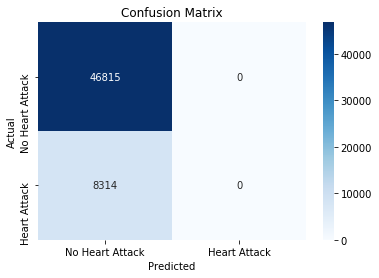

# Heart Attack Dataset Analysis: Insights on Youth and Adult Health in Germany

## Overview

This dataset provides valuable insights into the occurrence of heart attacks among individuals under 25 years (youth) and those 25 years and older (adults) across various states in Germany from 2015 to 2023. The data includes several health and lifestyle factors, such as hypertension, BMI (Body Mass Index), and socioeconomic status. The dataset is designed to encourage deeper exploration by being unevenly distributed, making the analysis more challenging and rewarding.

By analyzing this dataset, we aim to understand the factors contributing to heart attacks and uncover patterns that might be used for preventive measures.

## Dataset Details

- **Age Group:** Categories representing individuals' age:
  - Under 25
  - 25+ years

- **Hypertension:** Whether the individual suffers from hypertension (High blood pressure).
  - Yes
  - No

- **Socioeconomic Status:** The socioeconomic status of the individual, which may correlate with heart health.
  - Categories: Low, Medium, High

- **BMI:** The Body Mass Index (BMI) of the individual, which is a common health indicator linked to heart disease risk.

---

### Analysis Visuals

Here are some visual representations of the analysis conducted on the dataset:

#### Heart Attack by Age

This graph illustrates the distribution of heart attacks across different age groups.

#### BMI by Socioeconomic Status

The relationship between BMI and socioeconomic status is highlighted in this visualization.

#### Confusion Matrix

A confusion matrix used to evaluate the classification model's performance.

#### Hypertension by Age

This graph shows the incidence of hypertension across age groups.

---

Feel free to explore the dataset further and use these insights to develop a deeper understanding of heart attack trends in Germany.
